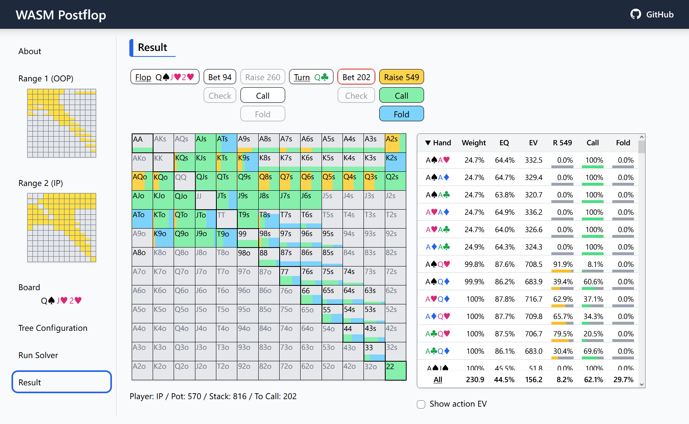
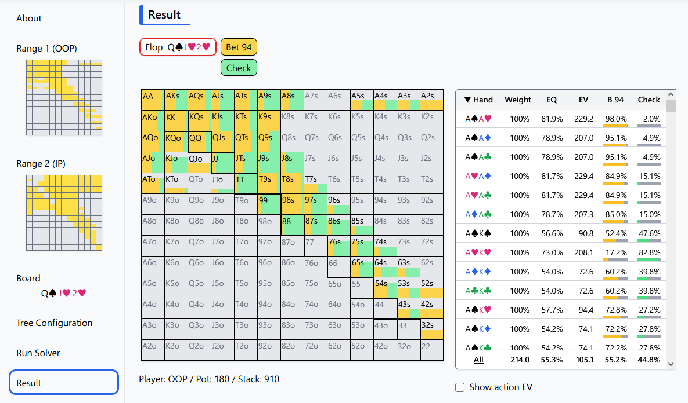
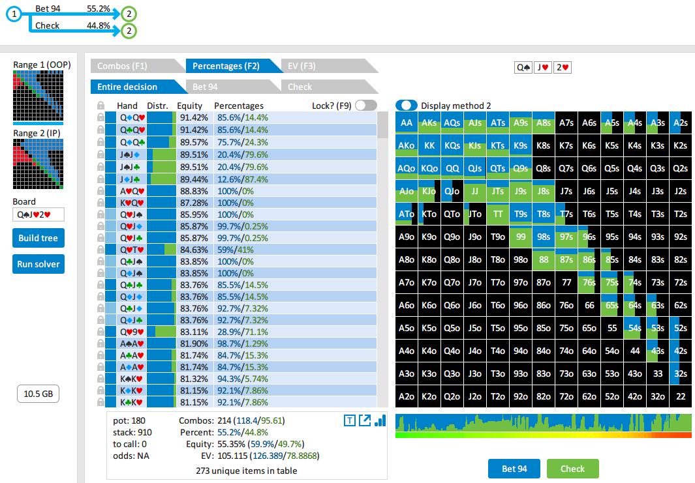
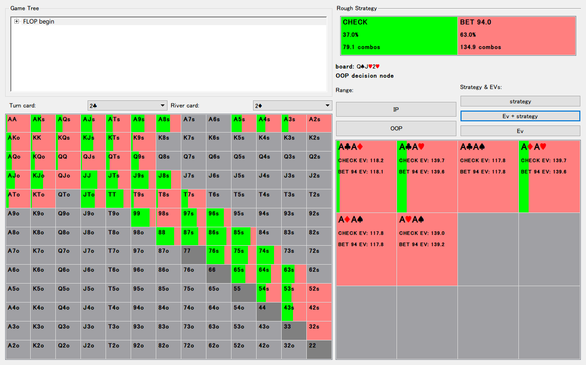

# WASM Postflop

> [!IMPORTANT]
> **As of October 2023, I have started developing a poker solver as a business and have decided to suspend development of this open-source project. See [this issue] for more information.**

[this issue]: https://github.com/b-inary/postflop-solver/issues/46

---

**WASM Postflop** is a free, open-source GTO solver for Texas hold'em poker that works on web browsers.

Website: https://wasm-postflop.pages.dev/

**Related repositories**
- Desktop application: https://github.com/b-inary/desktop-postflop
- Solver engine: https://github.com/b-inary/postflop-solver



## Why WASM Postflop?

The GTO (Game Theory Optimal) solver has become an indispensable tool for poker research.
However, unfortunately, there is a high barrier to trying out the GTO solver: the need to purchase expensive commercial software.
This project aims to overcome this situation by developing a free, open-source GTO solver.

Please note that this project does not intend to *replace* commercial GTO solvers.
They are great software, and it is not easy to create a new one that can compete with them.
This project intends to make the GTO solver more easily accessible to a broader audience.

### Features

- **Free to use**.
  The most important feature.
  Anyone can try out the solver for free!

- **Open source**.
  The implementation of the GTO solver is complex and is not easy to write down accurately.
  By making the program open source, we make it possible for anyone to examine the implementation.

- **Works on web browsers**.
  This feature brings several advantages.
  First, it allows for the solver to be easily accessible.
  Second, it naturally makes the solver a cross-platform application.
  Finally, it sandboxes the solver execution, so users do not have to worry about security.

- **Sufficiently fast**.
  Slow solvers are not wanted.
  By using WebAssembly, we have reduced the performance penalty of being a web application.
  We also supported multithreading and used a state-of-the-art algorithm ([Discounted CFR]).

[Discounted CFR]: https://arxiv.org/abs/1809.04040

## Comparison

We tested WASM Postflop, [Desktop Postflop] (v0.2.1), [PioSOLVER Free] (2.0.8), [GTO+] (v1.5.0), and [TexasSolver] (v0.2.0) with the "3betpotFAST" preset of PioSOLVER (all-in threshold is replaced with 100% in PioSOLVER).

[Desktop Postflop]: https://github.com/b-inary/desktop-postflop
[PioSOLVER Free]: https://www.piosolver.com/
[GTO+]: https://www.gtoplus.com/
[TexasSolver]: https://github.com/bupticybee/TexasSolver

### Execution time and memory usage

We experimented on a Windows 10 PC with a Ryzen 7 3700X CPU (16 threads; PioSOLVER Free is limited to 6 threads).
WASM Postflop was executed on Google Chrome 108.

The table below shows that Desktop Postflop, a native port of WASM Postflop, was the clear winner in terms of execution time.
WASM Postflop was about 2x slower than Desktop Postflop, and Pio CFR and GTO+ were between them.
In terms of memory usage, the 16-bit integer mode of WASM Postflop and Desktop Postflop, the original Pio algorithm, and GTO+ achieved almost the same efficiency.
TexasSolver, another free and open-source solver, suffered from slow execution times and poor memory efficiency.

We consider that 2x time overhead compared to Desktop Postflop is acceptable for casual use.
However, if you do not think so, please consider trying Desktop Postflop, which is also free and open-source.

(1) 32-bit FP / (2) 16-bit integer / (3) Pio CFR / (4) Original Pio algorithm

- **6 threads**

| Solver | WASM<br/>(1) | WASM<br/>(2) | Desktop<br/>(1) | Desktop<br/>(2) | Pio<br/>(3) | Pio<br/>(4) | GTO+ | Texas |
| :---: | :---: | :---: | :---: | :---: | :---: | :---: | :---: | :---: |
| **Time (Target: 0.5%)** | **33.4 s** | **42.2 s** | 20.0 s | *19.8 s* | 22.9 s | 30.3 s | 22.0 s | 103.5 s |
| **Time (Target: 0.3%)** | **41.2 s** | **52.3 s** | 24.9 s | *24.7 s* | 28.2 s | 42.4 s | 31.4 s | 149.0 s |
| **Time (Target: 0.1%)** | **71.9 s** | **92.6 s** | 44.4 s | *44.0 s* | 60.1 s | 108.4 s | 67.7 s | 285.9 s |
| **Memory usage** | **1.25 GB** | **660 MB** | 1.27 GB | 679 MB | 1.41 GB | 634 MB | 705 MB | 2.84 GB |

- **16 threads**

| Solver | WASM<br/>(1) | WASM<br/>(2) | Desktop<br/>(1) | Desktop<br/>(2) | GTO+ | Texas |
| :---: | :---: | :---: | :---: | :---: | :---: | :---: |
| **Time (Target: 0.5%)** | **21.1 s** | **26.1 s** | 12.6 s | *12.2 s* | 13.9 s | 67.1 s |
| **Time (Target: 0.3%)** | **26.0 s** | **32.3 s** | 15.6 s | *15.1 s* | 19.7 s | 95.9 s |
| **Time (Target: 0.1%)** | **45.5 s** | **57.2 s** | 27.9 s | *27.0 s* | 41.7 s | 182.6 s |
| **Memory usage** | **1.25 GB** | **660 MB** | 1.27 GB | 679 MB | 705 MB | 2.84 GB |

### Results

A comparison of the obtained results is as follows (target exploitability is set to 0.1%).
We can see that WASM Postflop, PioSOLVER, and GTO+ return nearly identical results.

| WASM Postflop | PioSOLVER | GTO+ | TexasSolver |
| --- | --- | --- | --- |
|  |  |  |  |

Specific values of Bet %, equity, and EV are as follows.
TexasSolver returned a different solution, which is presumably incorrect.
Either way, we cannot verify the correctness because we cannot see the overall EV in TexasSolver.

| Solver | WASM | Pio | GTO+ | Texas |
| :---: | :---: | :---: | :---: | :---: |
| **Bet %** | **55.2%** | 55.19% | 55.2% | 63.0% |
| **Equity** | **55.3%** | 55.347% | 55.35% | ? |
| **EV** | **105.1** | 105.11 | 105.115 | ? |

## Build

```sh
$ # prerequisites
$ rustup install nightly
$ rustup +nightly component add rust-src
$ rustup target add wasm32-unknown-unknown
$ cargo install wasm-pack
$ npm install

$ # build
$ npm run wasm
$ npm run build

$ # serve
$ npm run serve

$ # lint/format
$ npm run lint
$ npm run format
```

## License

Copyright (C) 2022 Wataru Inariba

This program is free software: you can redistribute it and/or modify it under the terms of the GNU Affero General Public License as published by the Free Software Foundation, either version 3 of the License, or (at your option) any later version.

This program is distributed in the hope that it will be useful, but WITHOUT ANY WARRANTY; without even the implied warranty of MERCHANTABILITY or FITNESS FOR A PARTICULAR PURPOSE.  See the GNU Affero General Public License for more details.

You should have received a copy of the GNU Affero General Public License along with this program.  If not, see <https://www.gnu.org/licenses/>.
